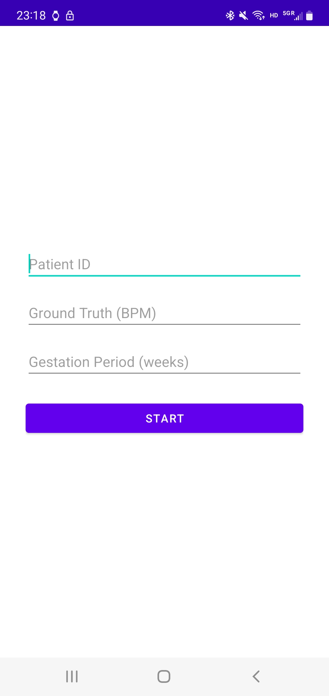
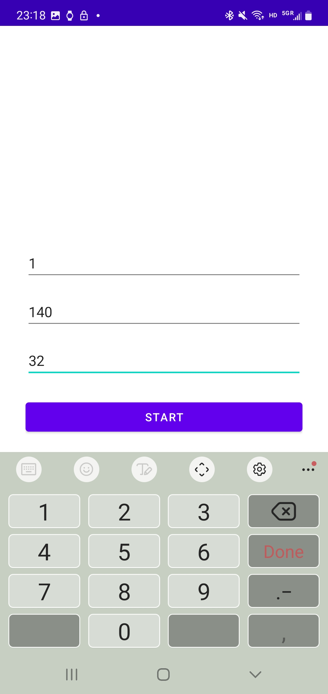
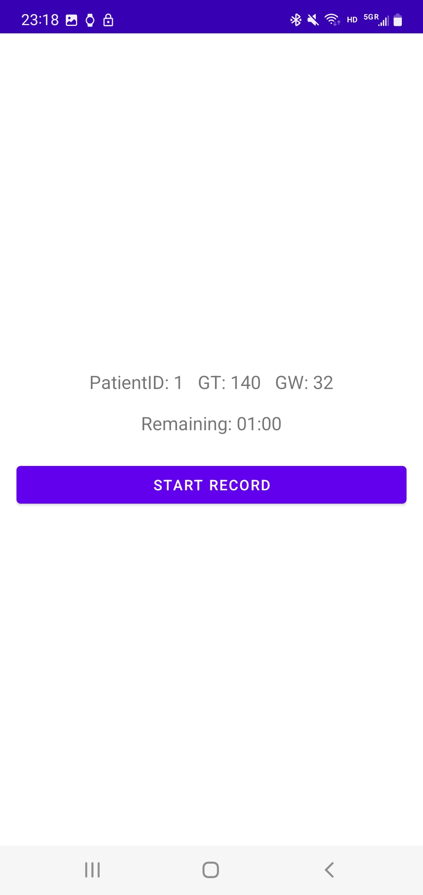
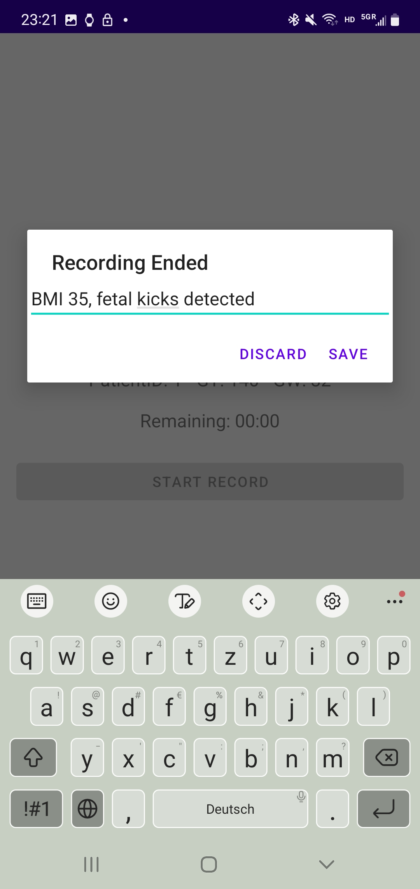

# Fetal Health Monitoring Android App

## Objective of the App
The goal of this research is to build an easy-to-use system for ubiquitous at-home monitoring of fetal health by pregnant women. This study will recruit 40 currently pregnant women. We will collect audio data from the mobile phone (i.e. reflections from the ultrasound signal emitted by the mobile device's speaker). All the participant's data will be de-identified and coded for analysis. 

## Backend of the App
The Android version of the App is built in Android Studio Chipmunk (2021.2.1) using Kotlin 1.8 and targets API level 33. It runs on Android 12 and above, allowing clinicians to use their personal Android device to non‐invasively capture Doppler audio. During data collection, the user launches the app, positions the phone’s speaker against the expectant mother’s abdomen, and taps “Start.” The app simultaneously plays an 18 kHz inaudible tone through the speaker and records the reflected sound via the device microphone at a 48 kHz sampling rate. When the session ends, the raw audio is saved locally as a WAV file and cataloged in a CSV log for later analysis.

## App Installation
There are two ways to install the app. Method 1 requires to download all the source code. This will allow developers to customize their app. Method 2 is simpler and more straightforward. Here, **Samsung SM-N9760** is used as an example.

### Method 1
#### PC prep
1. Open Terminal and enter `git clone https://github.com/Mingmmz/FHM_APP_Android.git`
2. Navigate to the local repo location
3. Install [Android Studio](https://developer.android.com/studio)
4. Open the downloaded **_FHM_APP_Android > DopFone_** folder using Android Studio
#### Phone prep
1. Open **Settings → About phone/device**
2. Find **Build number (IMEI)** and tap it **7 times**. You’ll see “You are now a developer!”.
3. Go back to **Settings → System (if needed) → Developer** options.
4. Scroll down and turn on **USB debugging**. If a warning pops up, tap OK.
5. Use a **data-capable USB cable**. Plug the phone into your PC.
6. On the phone, you may see a “USB for” notification—set the connection mode to **File transfer (MTP) or Transferring** files.
7. You’ll get a “Allow USB debugging?” prompt on the device—tap **Allow** (you can tick “Always allow from this computer” so you don’t get asked again).
8. Your phone should appear by its model name (e.g. Samsung SM-N9760) by the toolbar’s device selector dropdown (to the left of the green ▶️).
#### Run the app
Once your device is listed:
1. Select it in the dropdown.
2. Hit the Green ▶️ **Run** button.
3. Wait a few sec and enjoy :)

### Method 2
1. Download [app-release.apk](doc/app-release.apk) on your Android phone.
2. Allow to download
3. Open the downloaded file. The installation requirement will pop up, and choose a way you like to install it.
4. Open the app and enjoy :)

## Use of the App
The app will be opened and placed on the belly of the pregnant women with the speaker's side touching the belly. There are three screens of the app.

1. The first screen presents a text-entry page for the doctor to enter the custom-assigned **Patient ID** at the time of the consent process, the **Ground Truth** collected by the medical professional before using the device by using the gold standard device, and the **Gestation Period** of the pregnancy. After filling in all the information, hit the **Start** button.

        

2. The second screen is for data collection. On hitting the **start record** button, the ultrasound audio transmission as well as audio recording starts together to collect the reflections from the ultrasound signal emitted by the mobile device's speaker. There is a timer that shows how much total time is remaining till the audio recording and transmitting ends at the same time.

3. The last page records any **comments** from the doctor regarding the data collection session and re-directs to either the first page if the data collection was **saved** or the second if the data collection was not satisfactory and the medical professional would like **discard** the data and re-collect the new one by pressing the '**start record**' again. The saved data path will appear on the screen once **save** button is hit.

## Access Saved Recordings
1. All recordings and a CSV file noting the patient's info will be saved locally on the phone automatically
2. Some Android phones cannot directly access the local files without third-party applications such as **Solid Explorer**.
3. Open Solid Explorer. Grant it access to all the local files on your phone.
4. Find the path: _**Internal Memory > Android > Data > com.example.dopfone > Files**_
5. The CSV file can be fetched directly, and all the recordings are saved in the subfolder _**Music**_.

## Features of the App
### The App Inputs:
1. Patient ID (text entry from the doctor).
2. Ground Truth (text entry from the doctor).
3. Gestation period (text entry from the doctor).
4. Microphone audio is collected through the app.
5. Comments from the medical professional(text entry from the doctor).

### The App Outputs:
1. The app shows a timer running while the audio is being collected.
2. The phone's speaker transmits a 16-bit sine wave at 18kHz that falls under the ultrasound category of sound for the fetal heart rate analysis.
3. A CSV file notes the recording file name, patient ID, ground truth, gestation period, and notes (comments)

**Note:** The app **is not** intended to show the predicted values of the fetal heart rate to the user to avoid false positives.

## DataBase
The data is stored locally on the phone of the doctor (the phone used to collect the data).

## Data Processing
The app at the time is solely used for data collection purposes, and the data processing is done asynchronously by the researchers using a separate Python file after the data collection is over.
